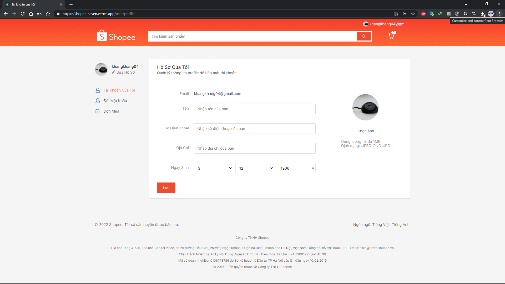

# Shopee

## Deploy https://shopee-seven.vercel.app/

## Mô tả ứng dụng

Trang web sử dụng RectJS với các framework và thư viện như:

1. Redux, Redux Toolkit
2. Styled component
3. React router dom
4. React hook form

## Ứng dụng mô phỏng shopee với các tính năng chính

1. Đăng nhập và đăng ký
   

2. Trang home với lọc các sản phẩm
   

3. Chi tiết sản phẩm
   

4. Xem giỏ hàng, mua, xoá sản phẩm
   

5. Chỉnh sửa thông tin người dùng
   

6. Thay đổi thông tin đăng nhập
   

7. Xem các đơn hàng đã đặt mua
   
